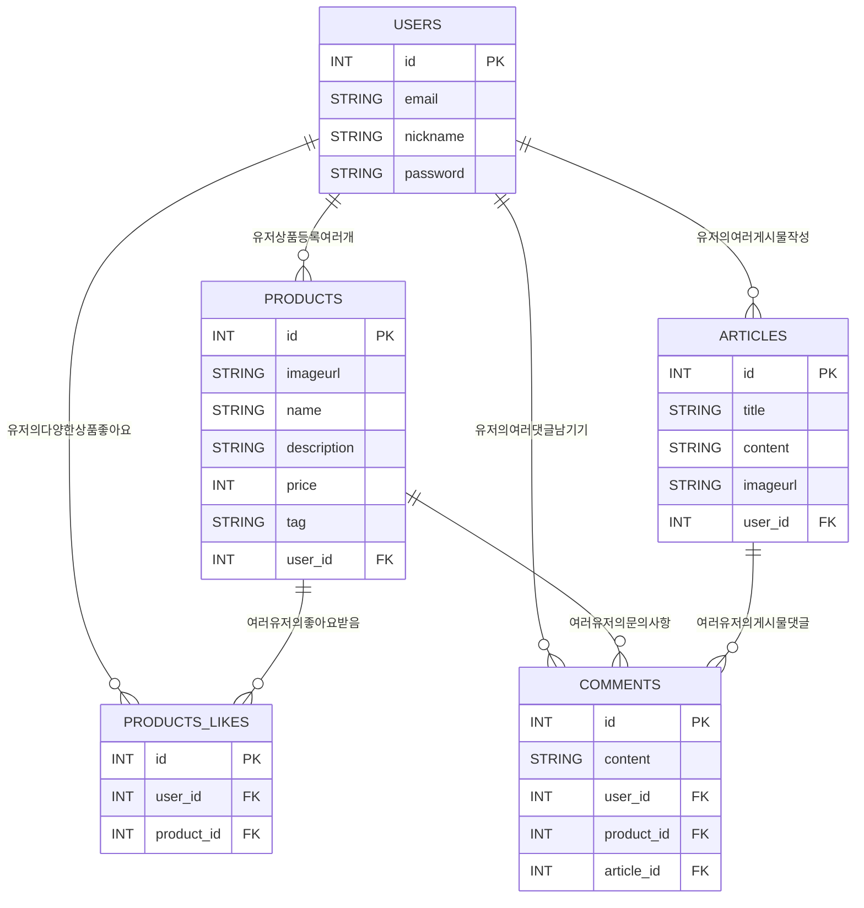

```mermaid

erDiagram
    USERS ||--o{ PRODUCTS : "유저상품등록여러개"
    USERS ||--o{ PRODUCTS_LIKES : "유저의다양한상품좋아요"
    PRODUCTS ||--o{ PRODUCTS_LIKES : "여러유저의좋아요받음"
    USERS ||--o{ ARTICLES : "유저의여러게시물작성"
    USERS ||--o{ COMMENTS : "유저의여러댓글남기기"
    PRODUCTS ||--o{ COMMENTS : "여러유저의문의사항"
    ARTICLES ||--o{ COMMENTS : "여러유저의게시물댓글"

    USERS {
        INT id PK
        STRING email 
        STRING nickname
        STRING password
    }

    PRODUCTS {
        INT id PK
        STRING imageurl
        STRING name
        STRING description
        INT price
        STRING tag
        INT user_id FK
    }

    PRODUCTS_LIKES {
        INT id PK
        INT user_id FK
        INT product_id FK
    }

    ARTICLES {
        INT id PK
        STRING title
        STRING content
        STRING imageurl
        INT user_id FK
    }

    COMMENTS {
        INT id PK
        STRING content
        INT user_id FK
        INT product_id FK
        INT article_id FK
    }

```
